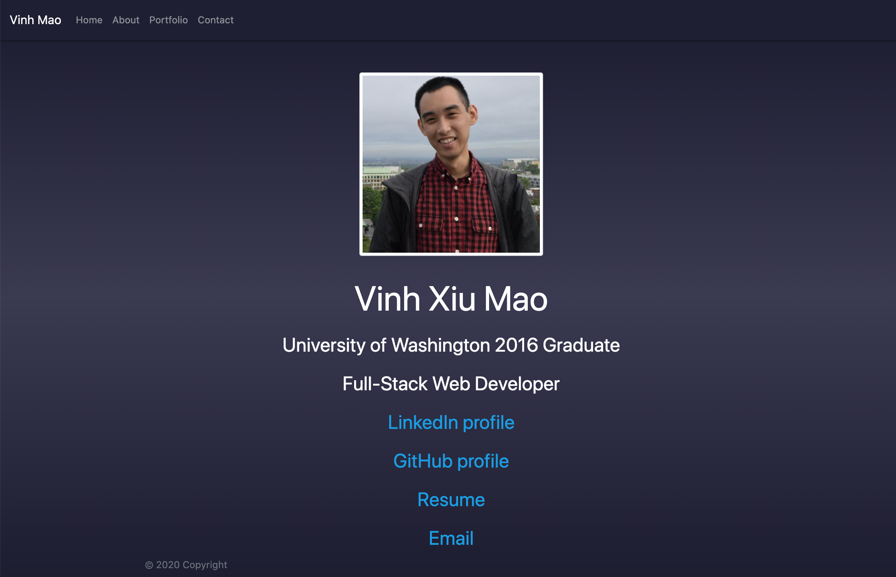
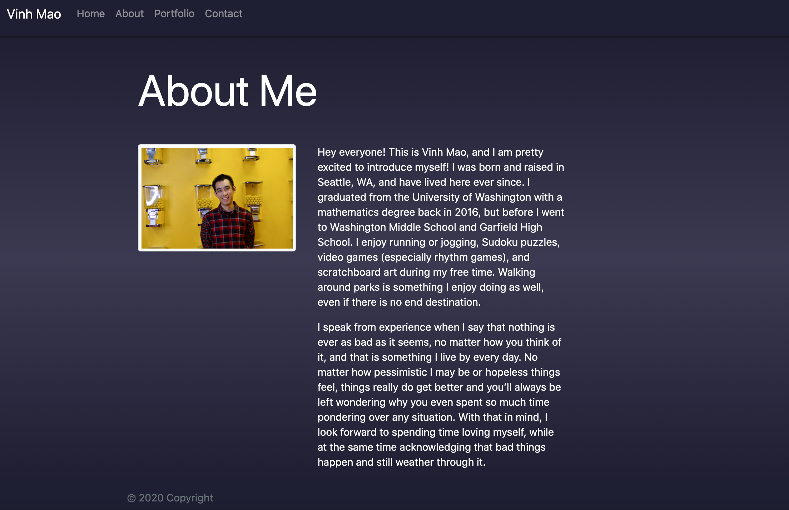

# React-Portfolio

  

## Table of Contents

* [Link](#link)
* [Description](#description)
* [Design](#design)
* [Future Development](#futuredevelopment)
* [Questions](#questions)

## Link

Access my portfolio [here](https://vxmao87.github.io/React-Portfolio/).

## Description

A recreation of my previous Bootstrap portfolio using React.

## Design

The overall design uses the following:

* React for the overall application
* `npm` for running React
* HTML, CSS, JavaScript and jQuery for website design

## Future Development

* Add functionality to Contact page to allow the user to send emails

## Questions

For questions or collaborations, please contact me through [GitHub](https://github.com/vxmao87).